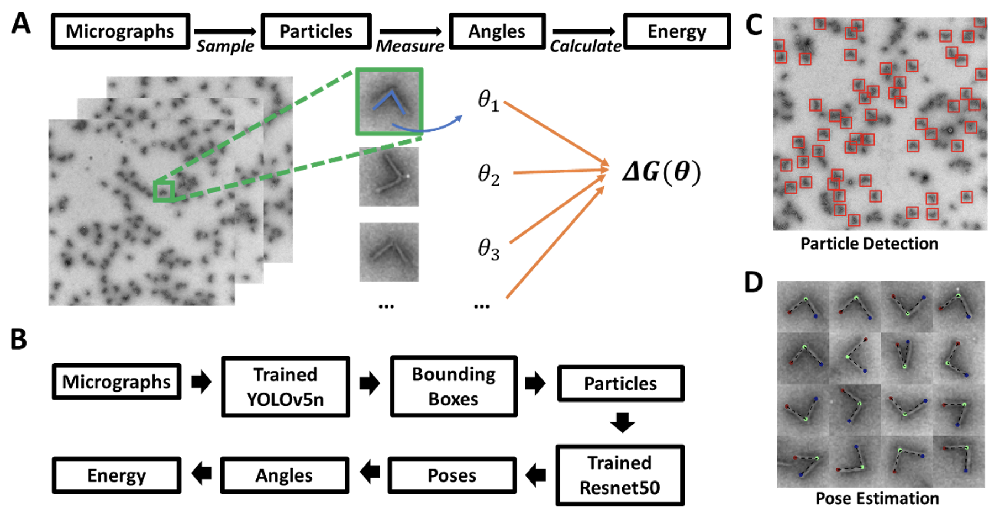

# Accelerating the Characterization of Dynamic DNA Origami Devices with Deep Neural Networks

In this repo, we designed a dynamic dNA origami device characterization framework based on computer vision and deep neural networks (DNNs). 

<p align="center"></p>

In the framework (as shown in the above figure (subfigure-B)), YOLOv5 and Resnet50 network architectures were used for the two key subtasks: particle detection and pose (i.e. conformation) estimation.

**Bacground and Motivations**: Mechanical characterization of dynamic DNA nanodevices is essential to facilitate their use in applications like molecular diagnostics, force sensing, and nanorobotics that rely on device reconfiguration and interactions with other materials. A common approach to evaluate the mechanical properties of dynamic DNA nanodevices is by quantifying conformational distributions, where the magnitude of fluctuations correlates to the stiffness. This is generally carried out through manual measurement from experimental images, which is a tedious process and a critical bottleneck in the characterization pipeline. While many tools to support analysis of static of molecular structures, there is a need for tools to facilitate the rapid characterization of dynamic DNA devices that undergo large conformational fluctuations.

For more details, please refer to our [paper](https://www.biorxiv.org/content/10.1101/2023.05.11.540408v1.abstract).

## Table of Contents
- [Accelerating the Characterization of Dynamic DNA Origami Devices with Deep Neural Networks](#accelerating-the-characterization-of-dynamic-dna-origami-devices-with-deep-neural-networks)
  - [Table of Contents](#table-of-contents)
  - [1. Dataset](#1-dataset)
  - [2. Particle Detection:](#2-particle-detection)
    - [2.1. Dataset Preparation:](#21-dataset-preparation)
    - [2.2. Training with YOLOv5](#22-training-with-yolov5)
    - [2.3. Predict based on trained model](#23-predict-based-on-trained-model)
  - [3. Pose estimation:](#3-pose-estimation)
  - [4. Citation](#4-citation)

## 1. Dataset

We release our dataset, including micrograph images and annotations,[HERE](https://osf.io/bmxhf/).

## 2. Particle Detection:

Generally, a small set of images need to be firstly trained to accomendatate the specific scenario, e.g., different DNA origami strucutures or any other objects. Usually it takes approximate 10 images or ~400 particles, but the performance shoud be better for larger training sets in principle. Once the training process is done (with decent validation performance),the generatated network (i.e. model) can be used to predict the particle location.
To do this, we will go for 3 steps:

*  Dataset Preparation
*  Training with YOLOv5
*  Predict based on trained model

### 2.1. Dataset Preparation:
In annotation, the format of bounding box location is as follows:

```plaintext
class x_center y_center width height
```

where the class represents the index of object. For homogenous structure the class number is always 0. The rest of 4 numbers is the normalized dimension of bounding box, e.g., if the width is 50 in a 960x960 image, the normalized number is 50/960=0.05208.

The annotation utility we used here is Roboflow with further box size rectification. Other 
tools such as CVAT, or MATLAB ROI will also work.

### 2.2. Training with YOLOv5

We train the [YOLOv5](https://github.com/ultralytics/yolov5) model with our dataset. To install the YOLOv5 framework:

```bash
git clone https://github.com/ultralytics/yolov5  # clone
cd yolov5
pip install -r requirements.txt  # install
```

For detailed guidance refer to [YOLOv5 repo](https://github.com/ultralytics/yolov5)

To train the model on our dataset, you will need to set the .yaml file. Example of dataset location input in *.yaml format:

```plaintext
# Train/val/test sets as 1) dir: path/to/imgs, 2) file: path/to/imgs.txt, or 3) list: [path/to/imgs1, path/to/imgs2, ..]
path: ../../XXXXXXX  # dataset root dir
train: XXXXXXXXX # train images (relative to 'path') 
val: XXXXXXXX # val images (relative to 'path') 
test:  # test images (optional)

# Classes
nc: 1  # number of classes, only one for DNA origami
names: ['x']  # class names
```

Typically training process can be done by running train.py script with argument in Python terminal. For example:

```bash
!python train.py --img 960 --batch 1 --epochs 200 --data Particle_Dection.yaml --weights your_pretrained_modelXXX(e.g.yolov5n).pt --cache
```

### 2.3. Predict based on trained model
The test dataset is in the same folder as trained set without annotation.
Typically inference process can be done by running detect.py script with argument in Python terminal. For example:

```bash
!python detect.py --weights your_trained_model.pt --img 960 --conf your_confidence_treshhold --source your_dataset_folder
```

The output of prediction will be the same format as annotation with additional confidence column. The particle can be cropped with MATLAB imcrop function. Further BBF can be found in 'YOLO_process_label_BBF.m'.


## 3. Pose estimation:
This workflow is similar to Particle Detection with 3 steps, i.e., prepare dataset, train, and predict. 

In this paper, the annotation was performaed in Image with 'Anlge Measurement' feature from a particle montage tif image (see dataset gallery folder) and the roiset is transferred into a sequential points with X column and Y column by 'ROI2CSV.m'. This points are further mapped with gallery by 'ProcessGallerytoParticlesPose.m'.
The example expected format for each particle is as follows:

```plaintext
Image_indices	x1	y1	cross1	cross2	x2	y2

nDFSB_R2_000000001.png	79	49	128	108	71	160
```

In this case, we have 3 critial points with 2D cooridiates. For training process please refer to DeepLabCut https://github.com/DeepLabCut/DeepLabCut

Example of configeration file format:


```plaintext
# Project definitions (do not edit)
    Task: TEM_angle_varyBKG
    scorer: YW
    date: Oct30
    multianimalproject:
    identity:

    # Project path (change when moving around)
    project_path: C:/SimMetaD/posev2/Dataset_mega

    # Annotation data set configuration (and individual video cropping parameters)
    video_sets:
    C:\SimMetaD\posev2\DeepLabCut-master\examples\openfield-Pranav-2018-10-30\videos\m4s1.mp4:
    crop: 0, 640, 0, 480
    bodyparts:
    - tipl
    - vertex
    - tipr
    start: 0
    stop: 1
    numframes2pick: 20
    # Plotting configuration
    skeleton: []
    skeleton_color: black
    pcutoff: 0.4
    dotsize: 8
    alphavalue: 0.7
    colormap: jet

       # Training,Evaluation and Analysis configuration
        TrainingFraction:
        - 0.95
        iteration: 6
        default_net_type: resnet_50
        default_augmenter: imgaug
        snapshotindex: -1
        batch_size: 1
              # Cropping Parameters (for analysis and outlier frame detection)
        cropping: false
            #if cropping is true for analysis, then set the values here:
        x1: 0
        x2: 640
        y1: 277
        y2: 624

      # Refinement configuration (parameters from annotation dataset configuration also relevant in this stage)
        corner2move2:
        - 50
        - 50
        move2corner: true
```


The output is predicted location of critical point with confidence score. To visualize the results, one can refer to 'Visualize_hinge_NUChinge.m'.

Additionally, you can also transfer the prediction result into ROI format that can be read by ImageJ. Here we employed python ROI decoder 'roifile'. Example roiset and customized Python script can be found in 'ImageJ_example' folder.

## 4. Citation

If you find this repo useful, please consider citing our paper:

```plaintext
@article{wang2023accelerating,
  title={Accelerating the Characterization of Dynamic DNA Origami Devices with Deep Neural Networks},
  author={Wang, Yuchen and Jin, Xin and Castro, Carlos},
  journal={bioRxiv},
  pages={2023--05},
  year={2023},
  publisher={Cold Spring Harbor Laboratory}
}
```
